**Pre-workshop reading — ~30 minutes** _Companion to the 3-Hour Agentic Workflows Workshop_

---

## How to use this document

Read this before the workshop. It explains _why_ Agno is shaped the way it is — the concepts, the architecture, and the design trade-offs — so the hands-on workshop can stay focused on building. If something in the workshop code feels arbitrary, the answer is almost always in here.

Each section has a diagram, a definition, and a "what to remember" callout. You don't need to memorize the API — that's what docs are for. You need to internalize the model.

> **Note:** Diagrams use Mermaid. They render natively on GitHub, GitLab, Notion, Obsidian, VS Code (with the Mermaid preview extension), and most modern markdown viewers.

---

## 1. What problem does Agno solve?

Most "agent frameworks" are libraries for stitching LLM calls together. Agno positions itself differently: it's a **runtime for agentic software**. The distinction matters.

Traditional software has a predictable execution model:

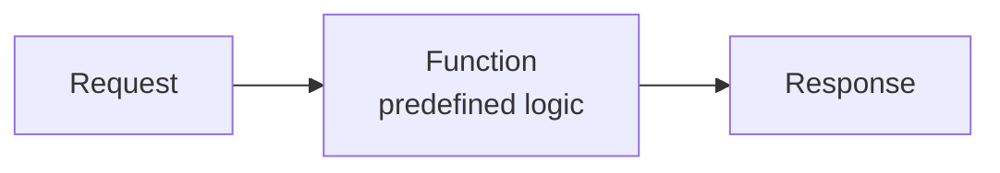

Agentic software does not:

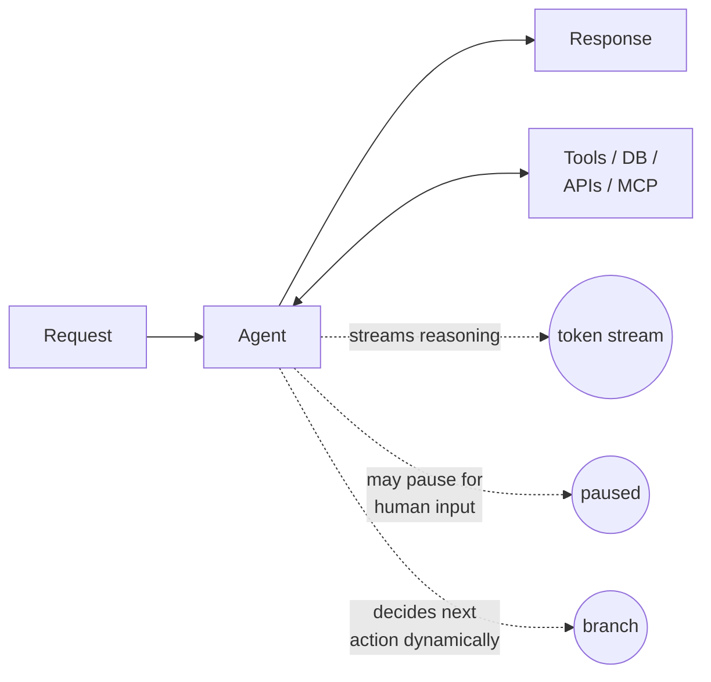

The runtime needs to handle three things that traditional web frameworks were never built for:

1. **Streaming + long-running execution** — responses arrive token-by-token over seconds or minutes, not as a single payload.
2. **Dynamic decision-making** — the model picks actions at runtime; some need approval, some need admin authority.
3. **Probabilistic execution paths** — the same input can produce different paths through the system.

Agno is built around these three shifts. That's why it bundles a framework (the Python SDK), a runtime (AgentOS, a stateless FastAPI app), and a control plane (the AgentOS UI). Most other frameworks give you only the first.

> **What to remember:** Agno treats streaming, pausing, and resumption as first-class primitives, not afterthoughts. If a feature elsewhere feels weird, it's usually because Agno is solving a problem you haven't hit yet — but will, in production.

---

## 2. The three-layer architecture

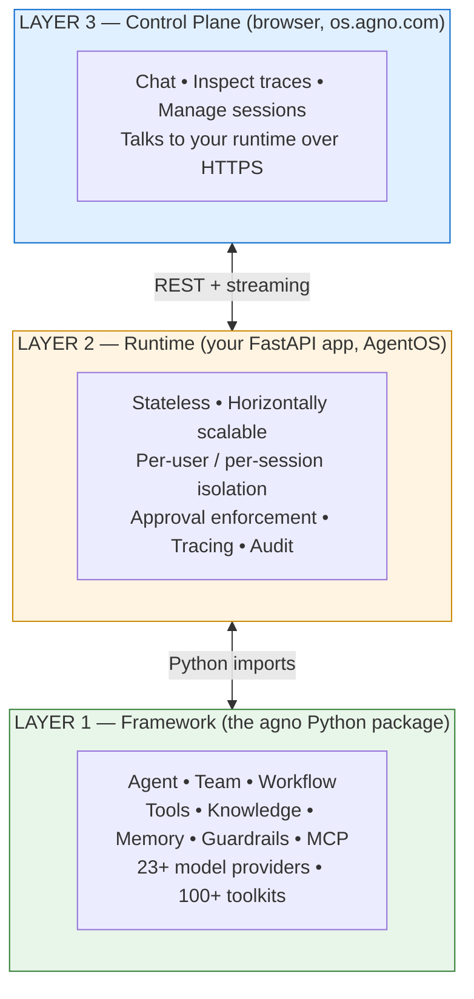

The key architectural decision: **the runtime runs in your infrastructure, the control plane runs in your browser**. There is no Agno server in the middle holding your data. Sessions, memory, knowledge, and traces all live in your database. The UI at `os.agno.com` is just a thin client that connects to your local or cloud-hosted AgentOS.

This is unusual for a hosted dev tool, and it's the reason Agno can be used in regulated environments (finance, healthcare, defense) without the usual "but does it leak data to the vendor?" review.

> **What to remember:** Three layers, one direction of trust. Your code at the bottom, your runtime in the middle, a UI on top. The UI is convenience; the framework and runtime are the product.

---

## 3. The composable units: Agent, Team, Workflow

Agno gives you three units of orchestration. Choosing between them is the most important design decision you'll make.

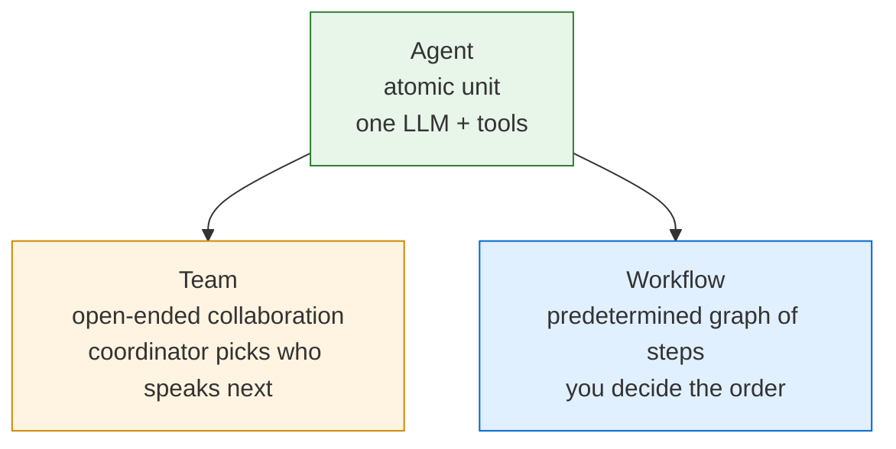

### Agent

A stateful LLM with tools, memory, instructions, and (optionally) knowledge. The atomic unit.

```python
agent = Agent(
    model=Claude(id="claude-sonnet-4-5"),
    tools=[YFinanceTools()],
    instructions="...",
    db=SqliteDb("agent.db"),     # gives it memory + sessions
    knowledge=Knowledge(...),    # gives it RAG
)
```

Use an agent when one specialist with the right tools can do the job. Most production systems are 70% single agents.

### Team

Multiple agents collaborating, with a **coordinator LLM** deciding who speaks next at runtime.

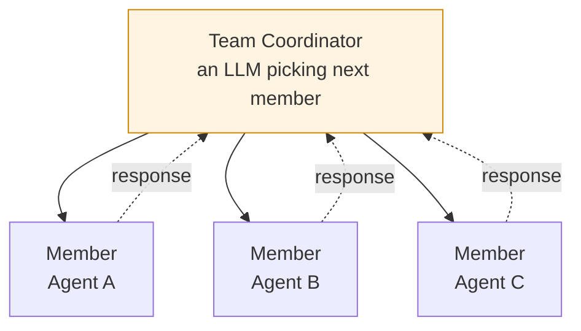

Use a team when the _path_ through the work is open-ended. "Research this stock" is open-ended — you don't know in advance whether you need fundamentals first, or competitor analysis, or both. The coordinator decides.

### Workflow

A **deterministic graph** of steps. You decide the order. The model only decides what each step says, not whether or in what order steps run (with one exception — `Router`).

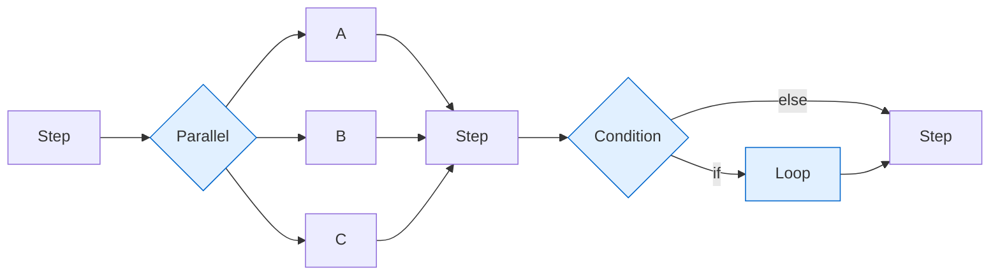

Use a workflow when you can name the stages in advance: classify → route → respond → review. Workflows are easier to debug, easier to test, and easier to optimize than teams. Reach for them whenever you can.

> **What to remember:** Workflow > Team > Agent in _predictability_. Agent < Team < Workflow in _upfront design effort_. Start small. Climb the ladder only when the current tier stops being enough.

---

## 4. The five workflow primitives

Every Agno workflow is built from five primitives. Once you grok these five shapes, you can compose any orchestration pattern.

### 4.1 Step — the atomic node

A `Step` runs exactly one of: an `agent`, a `team`, or a custom `executor` function. It takes a `StepInput` and returns a `StepOutput`.

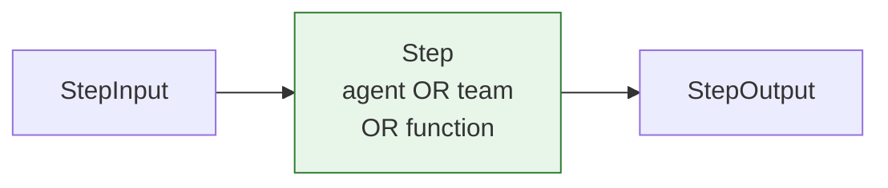

The `executor` function escape hatch is critical. When you need deterministic logic between LLM calls — parsing, validation, math, formatting — you write Python. You don't ask a model to do it.

### 4.2 Parallel — fan out, fan in

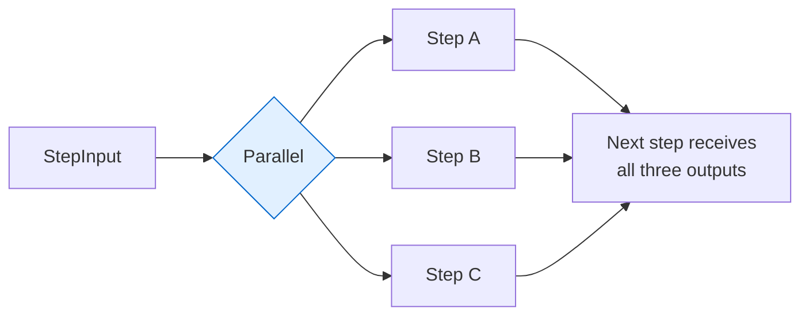

`Parallel(step_a, step_b, step_c)` runs them concurrently. The next step can pull each output by name via `step_input.get_step_content("step_a")`. Latency becomes `max(t_a, t_b, t_c)` instead of the sum. Use for independent fan-out work like multi-source research.

### 4.3 Condition — if-branch

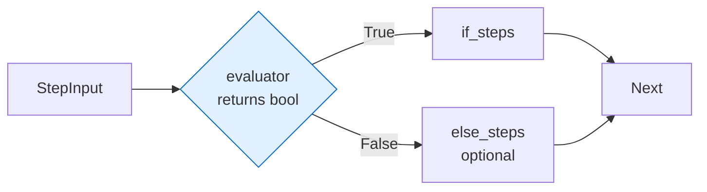

`Condition(evaluator=fn, steps=[...], else_steps=[...])`. The evaluator is a Python function returning bool. Use for "only do X when Y" gates — like running expensive analysis only on high-priority tickets, or invoking HITL only on irreversible actions.

### 4.4 Router — pick one branch dynamically

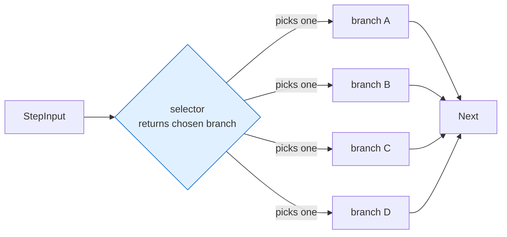

`Router(selector=fn, choices=[...])`. The selector is a Python function that returns `List[Step]` — the chosen branch. Use for classifier-driven dispatch: a triage agent labels the input, the router runs the matching specialist.

> **Condition vs Router:** Condition is "if/else" (boolean). Router is "switch/case" (N-way pick). They look similar, but conditions branch on _whether_, routers branch on _which_.

### 4.5 Loop — repeat until done

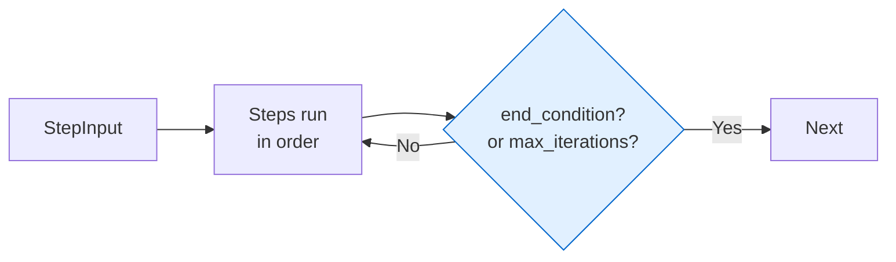

`Loop(steps=[...], end_condition=fn, max_iterations=N)`. Each iteration runs all steps in order; the end-condition is evaluated after each iteration with the list of step outputs from that iteration. Use for retry-until-good: draft → review → revise → review → ship.

### Composition

The five primitives nest freely — every primitive is itself a step. A real workflow looks like this:

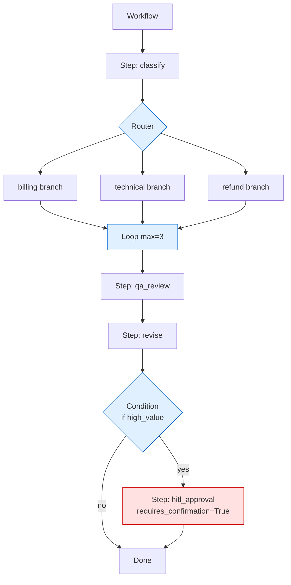

That's the entire Workflow 2 from the workshop, expressed as a tree.

> **What to remember:** Five shapes — Step, Parallel, Condition, Router, Loop. Everything else is composition.

---

## 5. State: sessions, memory, knowledge

This is where Agno diverges hardest from "just a wrapper around the OpenAI API." Agentic systems need three different kinds of state, and confusing them is the #1 cause of broken agents.

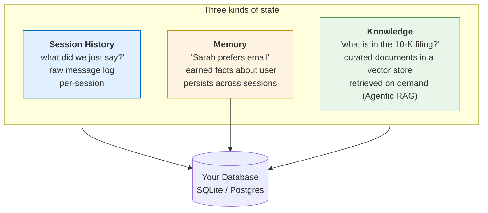

### Session history

Raw conversation messages, scoped to a `session_id`. When you set `add_history_to_context=True` and `num_history_runs=3` on an agent, Agno injects the last three turns into each new prompt. This is what "remembers what we just discussed" means.

### Memory

Distilled, durable facts about a user — extracted automatically by an LLM during conversations. "Sarah works in finance, prefers concise responses, is researching NVDA." Lives across sessions. Indexed by `user_id`. This is what "the agent learns over time" means.

### Knowledge

Curated documents (PDFs, URLs, text) chunked, embedded, and stored in a vector database. Retrieved on demand via similarity search when the agent decides it needs grounding. This is RAG, but the agent — not the framework — chooses when to retrieve. Hence "Agentic RAG."

> **What to remember:** History is what was said. Memory is what was learned. Knowledge is what was given. They are _not_ interchangeable, and trying to do all three with one mechanism (e.g., "just stuff everything into the context window") is how production agents become slow, expensive, and confused.

---

## 6. Tools, MCP, and the integration surface

Agents act through tools. Agno provides ~100 built-in toolkits (web search, finance, files, GitHub, Slack, calendars, …) and supports two ways to add more:

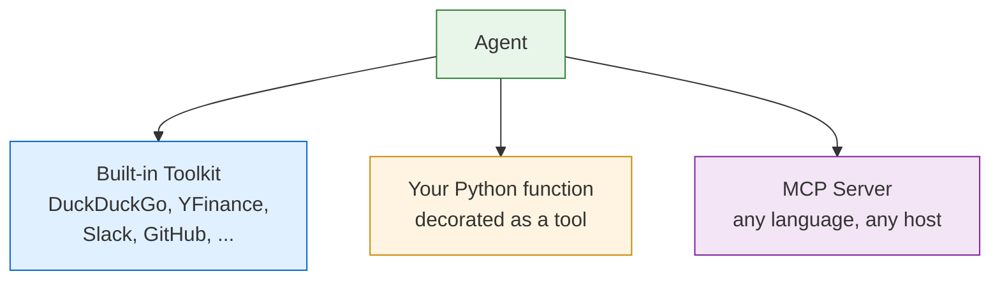

### Built-in toolkits

`from agno.tools.duckduckgo import DuckDuckGoTools`. Drop in and go.

### Custom Python tools

Any Python function with type hints can become a tool. Decorate it, attach it to an agent, you're done.

```python
from agno.tools import tool

@tool
def get_weather(city: str) -> str:
    """Get current weather for a city."""
    ...
```

### MCP (Model Context Protocol)

The emerging standard for connecting LLMs to external services securely. Agno is a first-class MCP client — point it at an MCP server URL and the server's tools become callable by your agent automatically.

```python
from agno.tools.mcp import MCPTools
agent = Agent(
    model=Claude(id="claude-sonnet-4-5"),
    tools=[MCPTools(url="https://docs.agno.com/mcp")],
)
```

MCP matters because it decouples tool authorship from agent authorship. Your security team writes the MCP server with proper auth, audit, and rate limits; your agent team consumes it without seeing credentials.

> **What to remember:** Built-in for the common case, Python decorator for the bespoke case, MCP for cross-team / cross-org integration. All three coexist on the same agent.

---

## 7. Human-in-the-loop, three flavors

Production agents do irreversible things — issue refunds, send emails, place trades. Agno bakes HITL into the runtime, not as a callback you wire up yourself. There are three patterns:

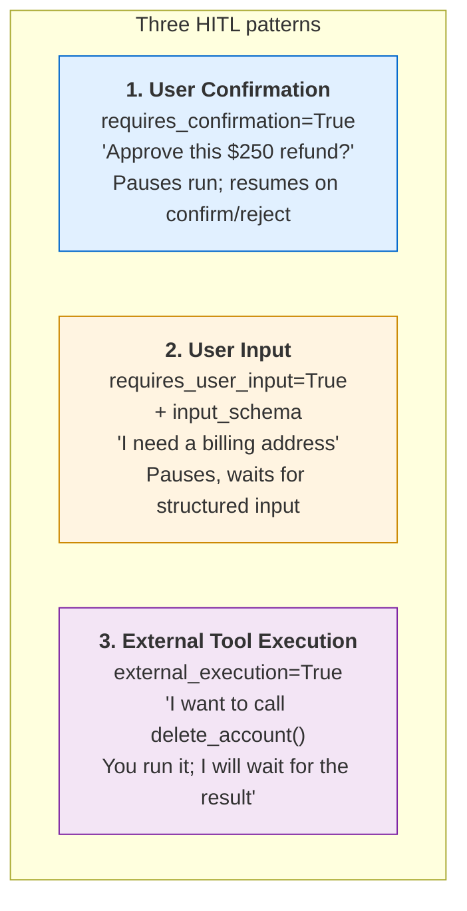

The mechanic is the same in all three: the workflow run **pauses**, persists its state to the database, and returns a `RunPaused`event with a `run_id`. Some other system — a Slack bot, an approval app, a queue worker — receives the run_id and eventually calls `workflow.continue_run(run_id, ...)`.

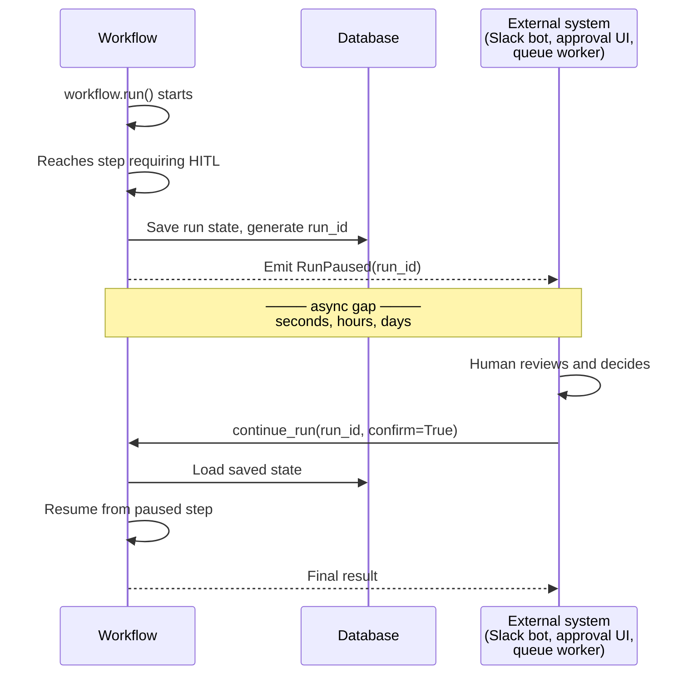

> **What to remember:** HITL in Agno is a pause-and-resume primitive backed by your database, not a synchronous "wait for input" call. That's what makes it work across web requests, queue workers, and human approval times measured in hours.

---

## 8. The runtime: AgentOS

`AgentOS` is the FastAPI app that exposes your agents/teams/workflows as a production API. The two key claims:

**Stateless.** No request affinity. Any AgentOS instance can serve any user. State lives in the database, not in the process. Scale horizontally by adding pods; no sticky sessions, no consistent hashing.

**Session-scoped.** Each request carries a `session_id` (and optionally `user_id`). The runtime hydrates the relevant session from the database, runs the agent, persists the new state, and returns. Your agent code never has to think about it.

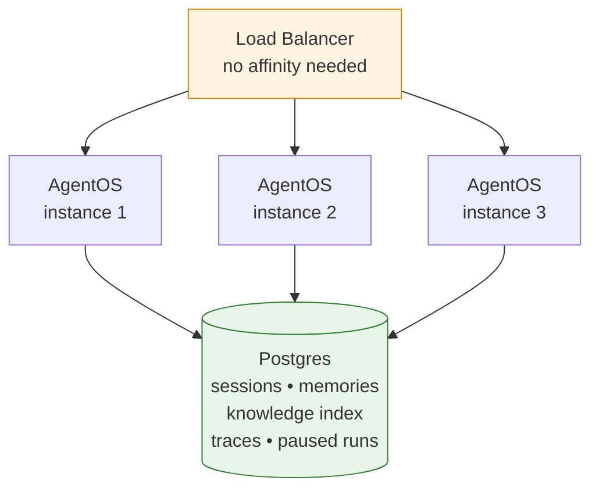

Endpoints you get for free:

```
GET    /health
GET    /agents | /teams | /workflows
POST   /agents/{id}/runs         ← start a run, optional streaming
POST   /workflows/{id}/runs      ← same, for workflows
POST   /runs/{run_id}/continue   ← resume a paused HITL run
GET    /sessions/{id}            ← read history
DELETE /sessions/{id}            ← end session
GET    /docs                     ← OpenAPI
```

> **What to remember:** AgentOS is to agents what FastAPI was to Python web APIs. It collapses "build the thing" and "ship the thing" into one decision.

---

## 9. Performance and why it matters

Agno is fast at agent instantiation — orders of magnitude faster than graph-based frameworks like LangGraph (the team reports ~3 µs to instantiate an agent and ~3.75 KiB of memory per agent). This sounds like a benchmark vanity stat, but it has real consequences.

In a stateless runtime, every request creates fresh agent instances from configuration. If instantiation is slow, your p99 latency suffers and your concurrency ceiling drops. If instantiation is fast, you can confidently spin up agents per-request without a hot-path optimization budget.

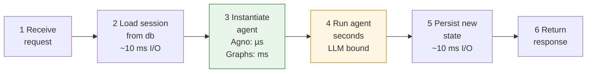

End-to-end latency is dominated by the LLM. But **throughput** under concurrent load is dominated by everything else, and step 3 is where graph frameworks pay a hidden tax.

> **What to remember:** Agno's performance philosophy is "make instantiation free, and you stop having to cache things you shouldn't have to cache." Statelessness becomes affordable.

---

## 10. The Five Levels of Agentic Software

Ashpreet Bedi (Agno's founder) published a useful staging framework that maps cleanly to how you'll grow systems built on Agno:

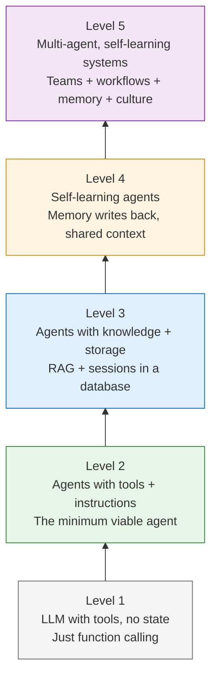

The key insight: **complexity is never free.** Every level adds debugging surface, latency, cost, and ways to fail. The discipline is to start at Level 1 and only climb when you've actually exhausted the current level's capabilities.

In practice, most production systems live at Level 3. The workshop's three workflows correspond roughly to:

- **Workflow 1** → Level 2 (agents + tools, plus parallel orchestration)
- **Workflow 2** → Level 3 (sessions, HITL, persistent state)
- **Workflow 3** → Level 4 (multi-agent team, served as runtime)

> **What to remember:** Multi-agent orchestration looks impressive in demos and breaks first in production. Resist the urge to start there. Level 3 with a single well-instrumented agent beats Level 5 with three flaky ones, every time.

---

## 11. When to use Agno (and when not to)

### Use Agno when

- You want to ship the agent as an API, not just run it from a notebook.
- You need persistent state — sessions, memory, knowledge — without writing the persistence layer yourself.
- You care about data residency: agents run in your cloud, data in your database.
- You want predictable orchestration (Workflows) for the parts of the system that have to be reliable, with Teams for the parts that don't.
- You're integrating across providers and want one API across Claude, GPT-5, Gemini, Llama, etc.

### Look elsewhere when

- You need TypeScript/JavaScript — Agno is Python-only as of v2.5.
- You're building a one-off script and don't need persistence or HTTP exposure. (Use the model SDK directly; you'll have less to learn.)
- Your orchestration is genuinely a complex stateful graph with many cycles and conditional edges — LangGraph's state-machine model may fit better.
- You're doing pure prompt engineering with no tool use, no memory, no multi-step flows. You don't need a framework for that.

> **What to remember:** Agno's sweet spot is "production agentic system, Python shop, you control the deploy target." If three of those four are true, it's the strongest choice on the market.

---

## 12. Glossary

|Term|Meaning|
|---|---|
|**Agent**|An LLM with tools, instructions, and (optionally) memory and knowledge.|
|**Team**|A coordinator-led group of agents collaborating on open-ended tasks.|
|**Workflow**|A deterministic graph of `Step`s built from Parallel/Condition/Router/Loop.|
|**Step**|A single workflow node — runs an agent, team, or function.|
|**StepInput / StepOutput**|The data passed between steps. `StepInput` provides `get_step_content(name)` for accessing prior outputs.|
|**AgentOS**|Agno's FastAPI runtime that exposes agents/teams/workflows as APIs.|
|**Session**|A scoped conversation context, identified by `session_id`, persisted in your DB.|
|**Memory**|Learned facts about a user (not raw history), persisted across sessions.|
|**Knowledge**|RAG store — chunked, embedded documents the agent retrieves on demand.|
|**MCP**|Model Context Protocol — a standard for exposing tools to LLMs via a server.|
|**HITL**|Human-in-the-Loop — pausing a run for human confirmation, input, or external execution.|
|**Tracing**|Structured logs of agent execution (steps, tools, tokens, timing) emitted automatically.|
|**Guardrails**|Pre/post-execution checks for inputs and outputs (PII, prompt injection, policy).|

---

## Reading list (in priority order)

1. **Agno docs — Quickstart:** [https://docs.agno.com/introduction/quickstart](https://docs.agno.com/introduction/quickstart)
2. **The Five Levels of Agentic Software:** [https://www.agno.com/blog/the-5-levels-of-agentic-software-a-progressive-framework-for-building-reliable-ai-agents](https://www.agno.com/blog/the-5-levels-of-agentic-software-a-progressive-framework-for-building-reliable-ai-agents)
3. **Workflows reference:** [https://docs.agno.com/reference/workflows/workflow](https://docs.agno.com/reference/workflows/workflow)
4. **Memory overview:** [https://docs.agno.com/basics/memory/overview](https://docs.agno.com/basics/memory/overview)
5. **AgentOS deployment guide:** [https://docs.agno.com/agent-os](https://docs.agno.com/agent-os)

You're ready for the workshop. We'll build all three workflows from scratch, and every concept in this primer will show up at least once.
