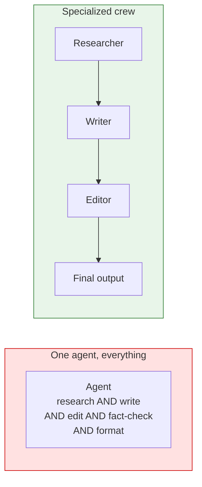
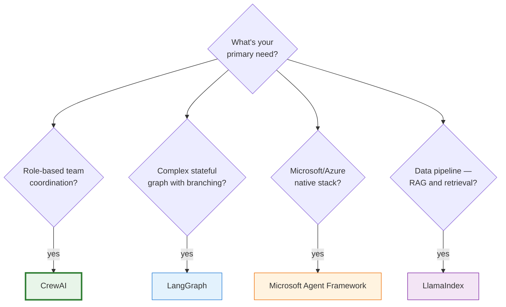
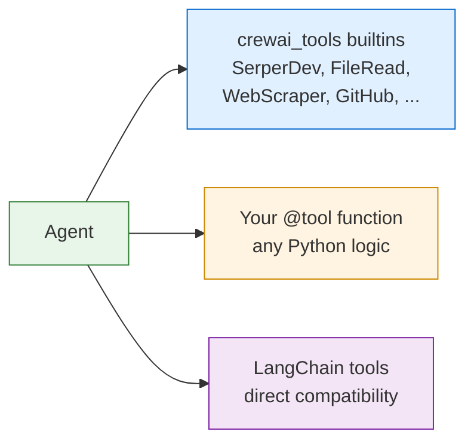
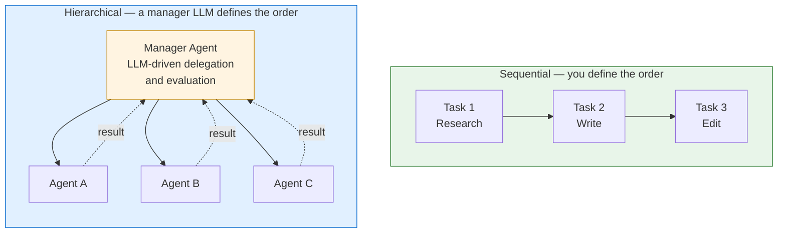
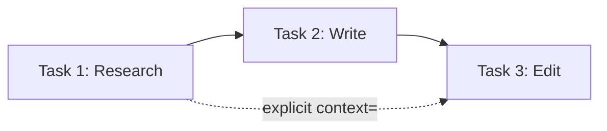
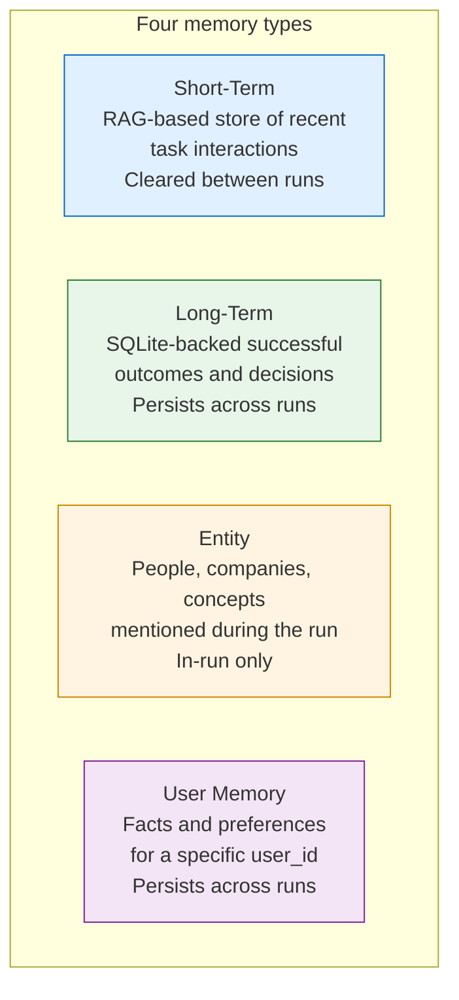

# CrewAI — A Primer

**A 100–300 level technical reference for engineers building multi-agent systems with CrewAI.**

> **Version:** 1.0 · **Targets:** CrewAI 0.80+ (Python) · **Last updated:** May 2026

---

## How to read this primer

This document layers content by depth. Read top-to-bottom for a complete picture, or jump to your level.

| Level | Focus | Audience |
|---|---|---|
| **100 — Concepts** | What CrewAI is, why it exists, where it fits | Anyone touching multi-agent code |
| **200 — Building Blocks** | Agents, tasks, tools, crews, kickoff | Engineers writing crew code |
| **300 — Architecture in Practice** | Process types, memory, Flows, async, production patterns | Engineers shipping crews |

The core idea before we start: **CrewAI is a role-based multi-agent framework.** You define who the agents are, what tasks they need to complete, and how they coordinate. The framework handles the orchestration. Everything in the API follows from that metaphor.

---

## Table of Contents

1. [Level 100 — Concepts](#level-100--concepts)
   - [What problem CrewAI solves](#what-problem-crewai-solves)
   - [The crew metaphor](#the-crew-metaphor)
   - [Where CrewAI fits in the 2026 landscape](#where-crewai-fits-in-the-2026-landscape)
2. [Level 200 — Building Blocks](#level-200--building-blocks)
   - [Agent: the role-based specialist](#agent-the-role-based-specialist)
   - [Task: a unit of deliverable work](#task-a-unit-of-deliverable-work)
   - [Tool: how agents act on the world](#tool-how-agents-act-on-the-world)
   - [Crew: the orchestration layer](#crew-the-orchestration-layer)
   - [kickoff() and variable injection](#kickoff-and-variable-injection)
   - [Output formats](#output-formats)
3. [Level 300 — Architecture in Practice](#level-300--architecture-in-practice)
   - [Sequential vs Hierarchical processes](#sequential-vs-hierarchical-processes)
   - [Context flow between tasks](#context-flow-between-tasks)
   - [Memory](#memory)
   - [CrewAI Flows](#crewai-flows)
   - [Async execution](#async-execution)
   - [Planning and human input](#planning-and-human-input)
   - [Event listeners](#event-listeners)
   - [When to use CrewAI and when not to](#when-to-use-crewai-and-when-not-to)
4. [Glossary](#glossary)
5. [Where to go next](#where-to-go-next)

---

# Level 100 — Concepts

## What problem CrewAI solves

Single-agent systems hit a ceiling. One agent with too many tools gets confused. One agent tasked with research, writing, editing, and fact-checking simultaneously produces mediocre work on all four dimensions.

Human organizations solved this problem long before LLMs: _specialization plus coordination_. A newsroom has reporters, editors, and fact-checkers — each with a defined role, specific skills, and a clear handoff. CrewAI applies the same pattern to LLM agents.



The framework's three core claims:

1. **Role clarity improves accuracy.** A model told "you are a senior financial analyst, your goal is to identify earnings risk factors" performs better on that task than a generic assistant.
2. **Task decomposition makes outputs controllable.** Each task has a defined expected output that can be validated and refined independently.
3. **Process types match orchestration to problem shape.** Some problems have a known sequence of steps; others need a manager to decide the order dynamically. CrewAI gives you both.

## The crew metaphor

Every CrewAI concept maps to a workplace analogy:

| Framework concept | Workplace analogy |
|---|---|
| `Agent` | An employee with a job title, goal, and skills |
| `Task` | A work item with a description and expected deliverable |
| `Tool` | Software or resources the employee can use |
| `Crew` | The team, with a process for how work gets done |
| `Process.sequential` | A linear handoff: A finishes, hands to B, B to C |
| `Process.hierarchical` | A manager who decides who does what and when |

This metaphor is load-bearing, not decorative. When you find yourself fighting it — trying to make one agent do radically different things, or writing tasks with vague deliverables — that's the framework telling you something about your design.

## Where CrewAI fits in the 2026 landscape



CrewAI's edge in 2026 is **the role metaphor**, the **low boilerplate for standard multi-agent pipelines**, and a growing community of pre-built crews and tools. Its weakness is **production runtime** — it's designed around Python scripts and notebooks; it doesn't give you a stateless HTTP API, horizontal scaling, or built-in HITL pause/resume the way Agno or LangGraph do.

Pick CrewAI when the answer to "who does what?" maps naturally to roles humans already understand. If the role metaphor feels forced, a different framework likely fits better.

---

# Level 200 — Building Blocks

## Agent: the role-based specialist

An agent is defined by four fields that together shape the model's behavior:

| Field | Purpose | Analogous to |
|---|---|---|
| `role` | Job title — scopes what the agent "is" | Employee's title |
| `goal` | What the agent is optimizing for | KPI / job objective |
| `backstory` | Context shaping tone, expertise, perspective | Resume and work history |
| `tools` | Actions the agent can take | Software on their laptop |

```python
from crewai import Agent
from crewai_tools import SerperDevTool

researcher = Agent(
    role="Senior Research Analyst",
    goal="Uncover cutting-edge developments in {topic} with rigorous sourcing",
    backstory="""You work at a leading tech think tank. Your expertise is identifying
    emerging trends before they become mainstream. You distrust hype and demand
    primary sources.""",
    tools=[SerperDevTool()],
    llm="openai/gpt-4o",   # or any LiteLLM string
    verbose=True,
)
```

`role`, `goal`, and `backstory` are injected into the system prompt verbatim. This is not decoration — the same model with a well-crafted backstory outperforms a generic assistant on specialized tasks. Treat these fields as prompt engineering.

**Per-agent LLM.** Every agent can use a different model. Assign a cheap fast model (GPT-4o-mini) to triage and routing agents, a powerful model (GPT-4o, Claude Sonnet) to synthesis and writing agents. `llm` accepts any LiteLLM model string: `"anthropic/claude-sonnet-4-6"`, `"openai/gpt-4o-mini"`, `"ollama/llama3"`.

**`max_iter` and `max_retry_limit`.** An agent has a default maximum of 20 reasoning iterations before it must output a final answer. Set lower for speed, higher for complex tasks. `max_retry_limit` controls how many times a failing tool call is retried.

## Task: a unit of deliverable work

A task defines what needs to be done, what the result should look like, and which agent does it.

```python
from crewai import Task

research_task = Task(
    description="""Investigate the latest AI developments in {topic}.
    Focus on: key players, recent breakthroughs, and market implications.
    Prioritize information from the past 6 months.""",
    expected_output="""A structured report with:
    - Executive summary (3 sentences)
    - 5 key developments with source citations
    - Market implication for each development""",
    agent=researcher,
    output_file="research_report.md",   # optional: write output to disk
)
```

`expected_output` is the most important field. The LLM uses it to know when the task is done. Vague expected outputs ("a good summary") produce vague results. Specific, structured expected outputs ("a JSON object with fields X, Y, Z") produce structured, predictable results.

**Structured output.** Bind a Pydantic model to get typed, validated output:

```python
from pydantic import BaseModel

class ResearchReport(BaseModel):
    executive_summary: str
    key_developments: list[str]
    market_implications: dict[str, str]

research_task = Task(
    description="Investigate AI trends in {topic}.",
    expected_output="A structured research report.",
    output_pydantic=ResearchReport,
    agent=researcher,
)

crew.kickoff(inputs={"topic": "AI agents"})
# task.output.pydantic → ResearchReport instance, fully validated
```

**Async tasks.** Set `async_execution=True` to run a task in parallel with other async tasks. The crew will wait for all async tasks to complete before passing to the next synchronous task.

## Tool: how agents act on the world

Tools are functions an agent can invoke. CrewAI supports three sources:



Custom tools use the `@tool` decorator. The docstring becomes the tool description — write it for the LLM, not for humans:

```python
from crewai.tools import tool

@tool("Stock Price Fetcher")
def get_stock_price(ticker: str) -> str:
    """Fetches the real-time stock price for a given ticker symbol.
    Use this when you need the current market price of a publicly traded company.
    Input: ticker symbol (e.g. 'AAPL', 'NVDA').
    Output: current price as a string."""
    # your implementation
    return f"${ticker}: 142.50"
```

For tools with complex arguments, use a Pydantic `BaseModel` as the `args_schema`:

```python
from pydantic import BaseModel, Field

class SearchInput(BaseModel):
    query: str = Field(description="The search query")
    max_results: int = Field(default=5, description="Max number of results")

@tool(args_schema=SearchInput)
def web_search(query: str, max_results: int = 5) -> list[str]:
    """Search the web and return URLs of relevant pages."""
    ...
```

**Tool caching.** Tools are cached by default — identical calls return cached results without re-execution. Disable per-tool with `cache_function=lambda: False` when freshness matters (live prices, current time).

## Crew: the orchestration layer

A crew binds agents, tasks, and a process type together:

```python
from crewai import Crew, Process

crew = Crew(
    agents=[researcher, writer, editor],
    tasks=[research_task, write_task, edit_task],
    process=Process.sequential,
    verbose=True,
    output_log_file="crew_log.txt",   # optional: log all activity
)
```

The `Crew` is the object you call `kickoff()` on. It is stateless between runs — you can call `kickoff()` multiple times with different inputs.

**Manager LLM.** For `Process.hierarchical`, you must supply the LLM that will act as the manager:

```python
crew = Crew(
    agents=[researcher, writer, editor],
    tasks=[analysis_task],
    process=Process.hierarchical,
    manager_llm="openai/gpt-4o",
)
```

## kickoff() and variable injection

`kickoff()` starts the crew. Pass an `inputs` dict to inject variables into any `{placeholder}` in agent roles, goals, backstories, and task descriptions:

```python
result = crew.kickoff(inputs={
    "topic": "AI in healthcare",
    "target_audience": "non-technical executives",
})
```

Variables resolve across the entire crew — one `inputs` dict reaches every agent and task.

**Batch execution.** Run the same crew against a list of inputs:

```python
results = crew.kickoff_for_each(inputs=[
    {"topic": "AI in healthcare"},
    {"topic": "AI in finance"},
    {"topic": "AI in education"},
])
```

**The `CrewOutput` object.** `kickoff()` returns a `CrewOutput` with:
- `.raw` — the final task's output as a string
- `.pydantic` — parsed Pydantic object (if `output_pydantic` was set on the final task)
- `.json_dict` — parsed JSON dict (if `output_json` was set)
- `.tasks_output` — list of `TaskOutput` for every task in the crew

## Output formats

Every task and crew has three output format options, set on the final task:

| Field on Task | Type | Returns |
|---|---|---|
| (default) | string | `.raw` — the LLM's raw text response |
| `output_json=MyModel` | Pydantic model | `.json_dict` — validated dict |
| `output_pydantic=MyModel` | Pydantic model | `.pydantic` — validated model instance |

Choose `output_pydantic` when the result feeds into more code. Choose `output_file` when the result is a deliverable (a markdown report, a Python script).

---

# Level 300 — Architecture in Practice

## Sequential vs Hierarchical processes

This is the most consequential design decision in a crew.



### Sequential

Tasks run in definition order. The output of each task is automatically passed as context to the next. Simple, predictable, token-efficient, easy to debug.

**Use when:** The stages are known in advance. "Research → Write → Edit" is sequential. The vast majority of production crews are sequential.

### Hierarchical

A manager LLM decides which agent to delegate each sub-task to, reviews the response, and determines when the goal is met. You define the agents and their capabilities; the manager figures out the execution order.

**Use when:** The work is genuinely open-ended and the right sequence of steps isn't knowable until you start. "Produce a comprehensive risk analysis" might require different sub-investigations depending on what the researcher finds.

**Costs:** Hierarchical processes use significantly more tokens (the manager LLM evaluates every response), are harder to debug (the execution path is dynamic), and can loop unexpectedly. Start sequential. Only switch to hierarchical after confirming the problem is genuinely open-ended.

> **Rule of thumb:** If you can write the stages on a whiteboard before running the crew, use sequential. If you can't, hierarchical is worth the cost.

## Context flow between tasks

In a sequential crew, each task automatically receives the output of the immediately preceding task as context. For non-adjacent tasks, use explicit `context`:

```python
edit_task = Task(
    description="Edit the article for clarity, accuracy, and tone.",
    expected_output="A polished final article ready for publication.",
    agent=editor,
    context=[research_task, write_task],  # receives both, not just write_task
)
```



For very long outputs that would overflow context, write intermediate results to files with `output_file="path.md"` and have downstream agents read them with a `FileReadTool`.

## Memory

CrewAI provides four memory types. Enable them on the crew:

```python
crew = Crew(
    agents=[...],
    tasks=[...],
    memory=True,   # enables short-term + long-term + entity
    embedder={
        "provider": "openai",
        "config": {"model": "text-embedding-3-small"},
    },
)
```



| Memory type | Persists across runs? | Use for |
|---|---|---|
| Short-term | No | Recalling context from earlier in the same run via RAG |
| Long-term | Yes | Learning from past runs — which approaches worked |
| Entity | No | Tracking relationships between named things in a run |
| User | Yes | Personalizing behavior per `user_id` |

Memory adds latency (embedding calls) and cost. Don't enable it for short, stateless pipelines. Enable it when runs are long enough that earlier context gets lost, or when cross-run learning matters.

## CrewAI Flows

Flows are the structured pipeline model in CrewAI, built on Python class methods and event decorators. Where Crews organize work around _agents and tasks_, Flows organize work around _methods and events_.

```mermaid
flowchart LR
    S[start method] -->|emit result| A[method A\n@listen]
    A -->|emit| B[method B\n@listen]
    A -->|emit| C[method C\n@listen]
    B --> D{router\n@router}
    D -->|branch_1| E[method E]
    D -->|branch_2| F[method F]
```

```python
from crewai.flow.flow import Flow, listen, start, router
from pydantic import BaseModel

class ArticleFlow(Flow):
    class State(BaseModel):
        topic: str = ""
        research: str = ""
        draft: str = ""

    @start()
    def initialize(self):
        self.state.topic = "AI in healthcare"
        return self.state.topic

    @listen(initialize)
    def run_research(self, topic: str):
        result = ResearchCrew().crew().kickoff(inputs={"topic": topic})
        self.state.research = result.raw
        return self.state.research

    @listen(run_research)
    def run_writing(self, research: str):
        result = WritingCrew().crew().kickoff(inputs={"research": research})
        self.state.draft = result.raw
        return self.state.draft

flow = ArticleFlow()
flow.kickoff()
print(flow.state.draft)
```

**Flows vs Crews:**

| | Crew | Flow |
|---|---|---|
| Unit of work | Task assigned to an Agent | Method on a Flow class |
| Orchestration | Process type (sequential/hierarchical) | `@listen`, `@router` decorators |
| State | Passed as task context | Typed `self.state` Pydantic model |
| Best for | Role-based multi-agent work | Pipelines that combine multiple crews, branching, code |

**When to use Flows:** when you need to orchestrate _multiple crews_ in sequence or parallel, mix in deterministic Python logic between crew runs, or explicitly branch based on intermediate results. Flows wrap Crews; Crews don't wrap Flows.

**`@router`** lets a method return a string that selects which downstream `@listen` method runs next — the N-way equivalent of an `if/else`:

```python
@router(run_research)
def route_by_complexity(self, research: str) -> str:
    if len(research) > 5000:
        return "complex"
    return "simple"

@listen("complex")
def deep_analysis(self, research: str): ...

@listen("simple")
def quick_summary(self, research: str): ...
```

## Async execution

For parallel work, mark tasks as async and use the async kickoff:

```python
research_task = Task(..., async_execution=True)
data_task = Task(..., async_execution=True)
synthesis_task = Task(...)  # waits for both async tasks above

# Both async tasks run in parallel; synthesis waits for both
result = crew.kickoff(inputs={"topic": "AI trends"})

# Async kickoff — non-blocking
import asyncio

async def main():
    result = await crew.kickoff_async(inputs={"topic": "AI trends"})

asyncio.run(main())
```

For batch async runs across many inputs:

```python
results = await crew.kickoff_for_each_async(inputs=[
    {"topic": "AI in healthcare"},
    {"topic": "AI in finance"},
    {"topic": "AI in education"},
])
```

Async batch runs are the primary way to achieve throughput with CrewAI. Sequential `kickoff_for_each` is slow; `kickoff_for_each_async` runs all inputs concurrently (bound by your rate limits).

## Planning and human input

**Planning** adds an LLM pre-pass that creates an execution plan before any task runs. The plan is injected as context into all tasks:

```python
crew = Crew(
    agents=[...],
    tasks=[...],
    planning=True,
    planning_llm="openai/gpt-4o-mini",   # use a cheaper model for planning
)
```

Cost: one extra LLM call per run. Value: measurably better coherence on complex, multi-step tasks where getting the strategy right before execution matters.

**Human input** pauses a task at the CLI and waits for operator input before proceeding:

```python
review_task = Task(
    description="Review and approve the final draft.",
    expected_output="Approval or a list of required changes.",
    agent=editor,
    human_input=True,
)
```

This is synchronous and CLI-only — appropriate for development workflows and manual approval pipelines. It is not suited for production async APIs.

## Event listeners

CrewAI emits typed events throughout execution. Hook into them for logging, monitoring, or custom routing:

```python
from crewai.utilities.events import (
    TaskCompletedEvent,
    AgentActionTakenEvent,
    ToolUsageEvent,
)
from crewai.utilities.events.base_event_listener import BaseEventListener

class ProductionLogger(BaseEventListener):
    def on_task_completed(self, source, event: TaskCompletedEvent):
        # send to your observability platform
        metrics.record("task_completed", {
            "task": event.task.description[:50],
            "agent": event.task.agent.role,
        })

    def on_tool_usage(self, source, event: ToolUsageEvent):
        if event.tool_name == "web_search":
            metrics.increment("web_search_calls")

crew = Crew(agents=[...], tasks=[...])
crew.add_listener(ProductionLogger())
```

Key events: `CrewKickoffStartedEvent`, `CrewKickoffCompletedEvent`, `TaskStartedEvent`, `TaskCompletedEvent`, `AgentActionTakenEvent`, `ToolUsageEvent`, `ToolUsageErrorEvent`.

Parse `verbose` output for development. Use event listeners for production monitoring — events are stable, verbose output is not.

## When to use CrewAI and when not to

### Use CrewAI when

- The problem maps naturally to "different specialists, different tasks" — research + writing, analysis + review, code + test.
- You want role-based prompting with structured task handoffs and minimal boilerplate.
- Output quality per task matters — specialization pays off on complex, multi-step work.
- You're iterating quickly and want a framework that mirrors how you'd describe the work to a team.

### Look elsewhere when

- You need a **production HTTP API** with stateless execution, horizontal scaling, and HITL pause/resume — Agno is built for that; CrewAI is not.
- You need **fine-grained graph control** — explicit state schemas, conditional edges, checkpointing, time-travel — use LangGraph.
- The problem is fundamentally **single-agent** — don't force the multi-agent pattern onto problems one well-prompted agent can solve.
- You need **TypeScript** — CrewAI is Python-only.

---

# Glossary

| Term | Meaning |
|---|---|
| **Agent** | An LLM persona defined by role, goal, backstory, and tools. |
| **Task** | A discrete unit of work with a description, expected output, and assigned agent. |
| **Crew** | The orchestrator that binds agents, tasks, and a process type together. |
| **Process** | Execution strategy: `sequential` (defined order) or `hierarchical` (manager LLM decides). |
| **Tool** | A callable function an agent can invoke to act on the world. |
| **Flow** | An event-driven pipeline using `@start`, `@listen`, `@router` class decorators. |
| **kickoff()** | Starts a crew run; accepts `inputs={}` for variable injection into placeholders. |
| **CrewOutput** | The return value of `kickoff()`, containing `.raw`, `.pydantic`, `.tasks_output`. |
| **context** | Explicit list of prior tasks whose outputs are passed to a given task. |
| **async_execution** | Task flag to run in parallel with other async tasks. |
| **planning** | Optional pre-run LLM planning pass; uses a separate (often cheaper) `planning_llm`. |
| **Short-term memory** | RAG-based in-run context store, cleared between runs. |
| **Long-term memory** | SQLite-backed store of successful outcomes, persists across runs. |
| **Entity memory** | In-run tracking of named entities (people, companies, concepts). |
| **human_input** | Task flag that pauses execution at the CLI for operator review. |

---

# Where to go next

1. **Quickstart:** https://docs.crewai.com/introduction
2. **Core concepts — Agents, Tasks, Crews:** https://docs.crewai.com/concepts/agents
3. **Process types:** https://docs.crewai.com/concepts/processes
4. **Flows:** https://docs.crewai.com/concepts/flows
5. **Memory:** https://docs.crewai.com/concepts/memory
6. **Tool reference and crewai_tools:** https://docs.crewai.com/concepts/tools
